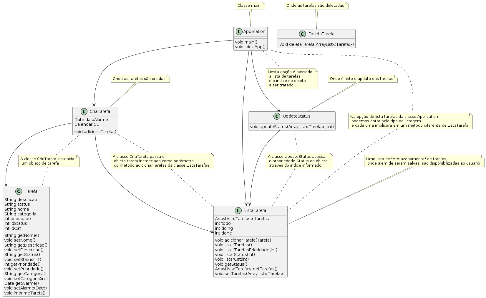

# 
 Todo List 

Projeto desenvolvido ao longo do programa Acelera ZG, promovido pela ZG Soluções, aonde nos foi proposto fazer uma TO-DO List (ou lista de afazeres) usando o java para o backend e HTML+CSS+JavaScript como front-end. 

## Sobre o backend ☕
Na trilha 3 do kit 1 nos foi proposto o desenvolvimento de uma aplicação todo-list em Java. 

### Requisitos

✅ CRD de Tarefas

✅ Deve ser possível listar as atividades por:

    Categoria
    Prioridade
    Status

✅ Quando uma nova atividade for inserida, deve ser feito o rebalanceamento da ordem verificando a prioridade da mesma, para inseri-la na posição ideal

✅ Ser possível consultar o número de atividades que foram concluídas (Done), estão para fazer (ToDo) e estão sendo feitas (Doing)

✅ Ser possível Atualizar tarefa

❗Seria um diferencial para o seu programa ter uma persistência. Não é interessante perder todas as atividades sempre que o programa é fechado, então pense em salvar os dados em algum arquivo (.csv, .txt, .docks etc).

✅ Implementar a opção de alarme para as tarefas

✅ Acionar o aviso de alarme quando o período definido chegar

### Diagrama de Classes:

### Saídas no console: 

## Front-end 
#### Tecnologias usadas:

#### IDE Utilizada 

 

## Back-end 
#### Tecnologias usadas

### IDE Utilizada

